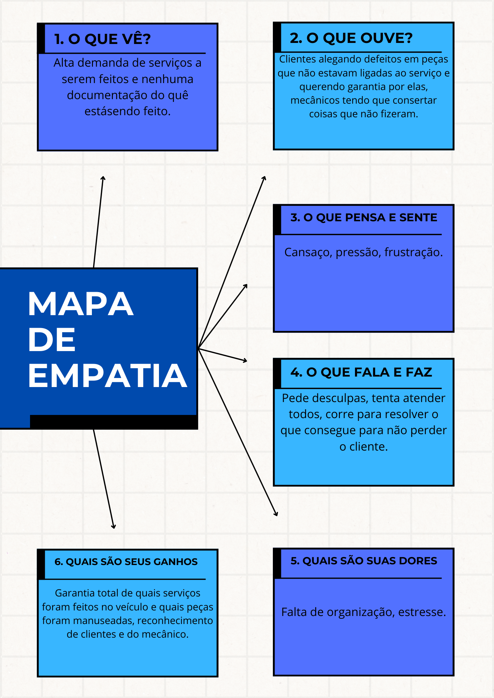

# Sistema de Registro de Serviços Mecânicos

Este repositório contém o design e o plano de implementação de um sistema simples de registro de Serviços Mecânicos, desenvolvido especificamente para pequenas oficinas mecânicas.

## Índice
- [Mapa de Empatia](#mapa-de-empatia)
- [Sprint Planning](#sprint-planning)
- [Protótipo de Solução](#protótipo-de-solução)
- [Teste e Feedback](#teste-e-feedback)

## Mapa de Empatia

O seguinte mapa de empatia foi criado para entender melhor as experiências diárias e os desafios da equipe de suporte em provedores pequenos:

| Área | Respostas |
|------|-----------|
| O que vê? | Alta demanda de serviços a serem feitos e nenhuma documentação do quê estásendo feito. |
| O que ouve? | Clientes alegando defeitos em peças que não estavam ligadas ao serviço e querendo garantia por elas, mecânicos tendo que consertar coisas que não fizeram. |
| O que pensa e sente? | Cansaço, pressão, frustração. |
| O que fala e faz? | Pede desculpas, tenta atender todos, corre para resolver o que consegue para não perder o cliente. |
| Quais são suas dores? | Falta de organização, estresse. |
| Quais são seus ganhos? | Garantia total de quais serviços foram feitos no veículo e quais peças foram manuseadas, reconhecimento de clientes e do mecânico. |

## Sprint Planning

### Objetivo da Sprint
**Criar um sistema simples para registrar e organizar serviços de clientes na oficina mecânica.**

### Product Backlog (Tarefas Técnicas)
1. **Estrutura de Dados (Dia 1)**
   - Criar modelo de dados para serviços (schemas)
   - Implementar banco de dados SQLite local
   - Desenvolver API REST básica para CRUD de serviços

2. **Frontend - Parte 1 (Dia 2)**
   - Implementar componente de listagem de serviços
   - Desenvolver formulário de cadastro com validações
   - Integrar com API para exibição de dados em tempo real

3. **Frontend - Parte 2 (Dia 3)**
   - Implementar função "Marcar como Resolvido" com atualização de status
   - Adicionar sistema de ordenação por data de criação
   - Desenvolver filtros básicos (serviços abertos/resolvidos)
   - Implementar responsividade para uso em dispositivos móveis

### Planejamento dos 5 dias

| Dia | Atividades |
|-----|------------|
| 1 | Definir informações principais e implementar estrutura de dados e API básica. |
| 2 | Desenvolver componentes frontend principais e integração com API. |
| 3 | Finalizar implementação de funcionalidades e adicionar responsividade. |
| 4 | Realizar testes de integração e correção de bugs. |
| 5 | Apresentar o protótipo funcional e coletar feedback. |

## Protótipo de Solução

### Telas a serem implementadas no Figma

#### 1. Tela Inicial: Login
* Título: "login"
* Lista de cartões com:
   * id do mecânico
   * Senha
   * Botão **[Entrar]**

#### 2. Lista de serviços
* Título: "serviços em Aberto"
* Lista de cartões com:
   * Nome do Cliente
   * Telefone
   * Descrição do Veículo (Montadora, Modelo, Motor, Ano, Placa)
   * Descrição do Problema
   * Peças Manuseadas, Trocadas, Reparadas
   * Prioridade (Baixa, Média, Alta) com cor e ícone indicativo
   * Data/Hora de abertura
   * Valor do Serviço (Peças, Mão de Obra)
   * Botão **[Marcar como Resolvido]**

#### 3. Tela de Cadastro de Serviço
* Título: "Novo Serviço"
* Campos para preencher:
   * Nome do Cliente
   * Telefone
   * Descrição do Veículo (Montadora, Modelo, Motor, Ano, Placa)
   * Descrição do Problema
   * Peças Manuseadas, Trocadas, Reparadas
   * Prioridade (Baixa, Média, Alta) com cor e ícone indicativo
   * Data/Hora de abertura
   * Valor do Serviço (Peças, Mão de Obra)
* Botão **[Salvar Serviço]**

### Fluxo de Uso (roteiro)
1. Mecânico abre a tela de "serviços em Aberto".
2. Clica em "Novo Serviço" para registrar um novo serviço.
3. Preenche os campos solicitados.
4. Salva o Serviço.
5. O Serviço aparece na lista, organizado por prioridade (alta primeiro) e depois por ordem de abertura.
6. Quando resolver o problema, clica em "Marcar como Resolvido".

## Teste e Feedback

### Feedback Simulado
* **O que funcionou bem:** "....."
* **O que pode melhorar:** "....."